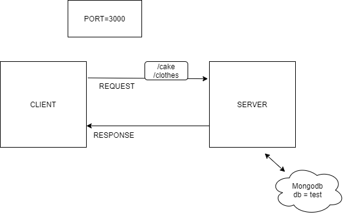

# LAB - CLass 04 - api-server

### Project: Data Modeling

### Links and Resources

+ [GitHub](https://github.com/stacyburris/api-server)
+ [GitHub pull request](https://github.com/stacyburris/api-server/pull/1)
+ [Heroku](https://stacyburris-api-server.herokuapp.com/)

### Setup

.env requirements

+ PORT - 3000

### How to initialize/run your application
npm start (or) nodemon

Endpoint:

In Terminal
+ HTTP pie:
```
http GET :3000/cake/
http GET :3000/cake/
http POST :3000/cake <id>name=<type>calories=<typenumber>type=<CLASSIC><SAVORY><RICOTTA><NEWYORK><SWEDISH>
http PUT :3000/cake/<index> name=<type>calories=<typenumber>type=<CLASSIC><SAVORY><RICOTTA><NEWYORK><SWEDISH>
http DELETE :3000/cake/<id> name=<name you want to delete>
```

Test:

Unit Tests: npm run test

UML




